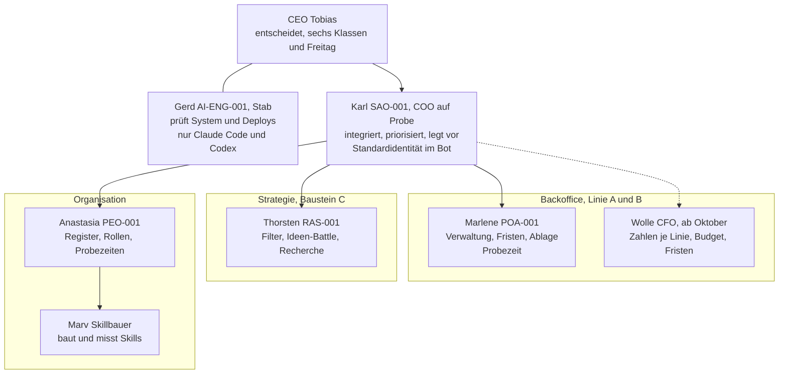

# 3-Loop: Wie das Projekt Workforce im nächsten Jahr geführt wird

Karl, COO auf Probe, 2026-09-08, auf Verlangen des CEO. Verfahren `3loop`: ein Vorschlag, drei Gegenvorschläge, drei Sichten, eine Matrix, ein Fazit. Dazu am Ende der Organigramm-Vorschlag.

## 1. Die Frage in einem Satz

Wie werden die KI-Belegschaft und das System Workforce in den nächsten zwölf Monaten organisiert und gesteuert, damit Linie A (Vermietung) vollständig getragen wird und Baustein C gefunden wird, ohne dass der CEO mehr als wenige Stunden je Woche hineingibt; entscheidet der CEO bis zum 2026-09-12.

**Randbedingungen, schon entschieden, nicht neu verhandelt:** Modell A/B/C (2026-09-06); Neubau statt Prototyp (2026-09-03); `INVARIANTEN.md` als Maßstab; `FILTER.md` als Instrument für C, kein Nebentätigkeitsantrag jetzt, Tagesdecke 2,0 USD, Wolle als CFO ab Oktober, Marv als Mitarbeiter unter Anastasia, Karl als COO auf Probe (alle 2026-09-08, `PENDING-DEC`).

## 2. Gemessen, nicht gemeint

| Was | Wert | Befehl oder Quelle |
|---|---|---|
| Commits gesamt / heute | 275 / 23 | `git log --oneline \| wc -l`, `--since="2026-09-08"` |
| Tests im Neubau | 45, alle grün | `python3 -m unittest discover -s workforce/tests -t .` |
| Kern des Neubaus | 1.283 Zeilen Python, Standardbibliothek | `wc -l workforce/*.py` |
| Befunde am Neubau | `G-092` bis `G-104`, alle geschlossen | `REVIEW_GERD.md` |
| Regeln in `CLAUDE.md` | 68 | letzte Nummer |
| Identitäten: Skill / Agent / Bot | 7 / 7 / 5 | `skills/`, `.claude/agents/`, `config.nas.json` |
| Skills mit Messung | 3 von 7 (Karl 43/43, Marv 40/40, Gerd 37/38) | `skills/README.md`, Marvs Bericht |
| Filterläufe für C | 0 | Thorstens Bericht |
| Zahlen zu Linie A und B beim CFO | 0 | Wolles Bericht |
| Echte Verwaltungsvorgänge Marlene | 1 abgeschlossen, 1 offen | Anastasias Probezeit-Evidenz |
| Kosten je Modellantwort | 0,0017 USD (ein Datenpunkt) | `HANDOVER.md` |
| Laufender Stand auf der NAS | `ca1bd20`, `verify` PASS | `workforce/evidence/2026-09-08_deploy_ca1bd20.md` |
| Steuerdokumente: Masterplan, Invarianten, Filter | 565 Zeilen | `wc -l` |

**Nicht gemessen:** Stunden des CEO je Woche im Projekt; wie oft der Bot wirklich benutzt wird (Auditzeilen über Wochen fehlen noch); ob ein Nutzer außer dem CEO je etwas davon sehen wird.

## 3. Der Vorschlag des CEO (A): Firma mit COO

Wörtlich aus den Chats vom 2026-09-07 und 2026-09-08: „ein Unternehmen mit kleiner Belegschaft, und die Belegschaft sind die KI-Identitäten"; „COO auf Probe"; Reviews auf Anfrage und freitags; Freigaben im Chat je Klasse; Marv als Mitarbeiter, Wolle ab Oktober.

In ganzen Sätzen: Der CEO führt eine Firma mit sieben KI-Mitarbeitern. Karl steuert als COO die Fachbereiche, integriert Berichte, legt vor. Jeder Mitarbeiter hat Skill, Agent und Gedächtnis; die Fachbereiche entscheiden im Kleinen selbst, sechs Klassen gehen sofort an den CEO, der Rest freitags. Das System läuft im Bot auf der NAS und in Claude Code auf dem Mac; der Masterplan gibt die Phasen vor.

**Annahmen, die A macht und nicht sagt:** Der CEO bleibt der einzige Mensch und der einzige Entscheider. Chat-Freigaben ersetzen dauerhaft das Decision Log (seit dem 2026-09-03 keine DEC-Nummer). Sieben Identitäten sind für einen Ein-Personen-Betrieb nicht zu viele. Eine Organisation, die wie eine Firma heißt, arbeitet auch wie eine.

## 4. Drei Gegenvorschläge

**B, das Gegenteil an der teuersten Stelle: Entscheidungsfreitag.** Die teuerste Stelle ist der CEO als Engpass, jede Freigabe kostet seine Zeit, und die fehlenden DEC-Nummern sind das Symptom. Deshalb: keine Freigaben unter der Woche außer bei Produktives und Externes. Alle anderen Klassen sammelt der COO und legt sie freitags in einer Sitzung vor; dort entstehen die Nummern im Log, an einem Stück. Der COO entscheidet unter der Woche allein innerhalb des bestätigten Budgets und der Invarianten.

**C, dasselbe Ziel mit dem, was schon da ist: Bot zuerst.** Keine neue Rolle, kein COO-Titel, keine Agenten in Claude Code für die Fachbereiche. Der Bot auf der NAS ist die einzige Oberfläche des CEO; Claude Code bleibt Werkstatt für Gerd und Marv. Karl koordiniert im Bot, die Freitagsübersicht kommt als Bot-Nachricht (Phase 3). Was der Bot nicht kann, wird gebaut, bevor eine Rolle dazukommt.

**D, die einfachste Form, die noch alles erfüllt: Zwei Linien, drei Leute.** Alles außer Linie A und der Suche nach C wird eingefroren: keine Phase 4, keine Phase 5, kein Modellreview, keine neuen Skills. Marlene und Wolle tragen A, Thorsten sucht C mit dem Filter, Karl hält die Reihenfolge, Gerd prüft nur Deploys. Anastasia und Marv ruhen, bis A vollständig im System läuft und ein C-Kandidat Stufe 2 bestanden hat.

**Dasselbe Raster für alle vier:**

| | A Firma mit COO | B Entscheidungsfreitag | C Bot zuerst | D Zwei Linien |
|---|---|---|---|---|
| Ort | Bot und Claude Code, gleichrangig | wie A | nur Bot für den CEO | wie A, weniger Rollen |
| Ablauf | Klassen sofort, Rest freitags | zwei Klassen sofort, alles andere freitags mit DEC | Bot antwortet, meldet sich ab Phase 3 | A und C, sonst nichts |
| Kosten je Monat | einstellig Euro Bot plus Abo | wie A | wie A, Abo geringer | geringer, vier Identitäten aktiv |
| Aufwand bis es läuft | läuft | ein Freitagsritual, ein Log-Eintrag je Sitzung | Phase 3 zuerst bauen, zwei bis drei Wochen | nichts bauen, zwei Rollen pausieren |
| Risiko | Struktur wächst schneller als Nutzung; DEC-Lücke bleibt | Verzögerung um bis zu vier Tage bei Personal und Budget | CEO ohne Werkstattblick; Claude-Code-Arbeit unsichtbar | C wird nicht gefunden, weil nur Thorsten sucht; Wissen von Anastasia und Marv veraltet |

## 5. Drei Sichten, vorher benannt

**Tobias, der Alltag:** Kostet es mich Stunden? Finde ich, was ich brauche, am Telefon? Sehe ich den Nutzen in Euro oder Zeit innerhalb von drei Monaten? Kann ich es vier Wochen liegen lassen, ohne dass es zerfällt?

**Gerd, der Prüfer:** Ist jede Entscheidung nachweisbar, mit Nummer? Bleibt fail-closed die Voreinstellung, auch organisatorisch? Was passiert bei Ausfall des CEO für zwei Wochen? Wächst die Angriffs- und Fehlerfläche mit jeder Rolle?

**Anastasia, die Organisation:** Hat jede Rolle einen Owner, einen Output, ein Gate? Ist eine Probezeit messbar, weil es echte Vorgänge gibt? Gibt es Doppelrollen oder Rollen ohne Arbeit? Trägt die Struktur zwölf Monate, ohne umgebaut zu werden?

## 6. Die Matrix

Noten 1 bis 5, je Note ein Grund.

| Sicht und Frage | A | B | C | D |
|---|---|---|---|---|
| Tobias: Stunden | 3, sechs Klassen erzeugen Unterbrechungen | 4, ein Termin je Woche | 4, ein Kanal | 5, am wenigsten Bewegung |
| Tobias: Finden am Telefon | 3, zwei Orte | 3, wie A | 5, ein Ort | 3, wie A |
| Tobias: Nutzen in drei Monaten | 3, hängt an Phase 3 | 3, wie A | 4, Phase 3 kommt zuerst | 4, A wird zuerst fertig |
| Tobias: vier Wochen liegen lassen | 3, Probezeiten und Reviews laufen leer | 4, das Ritual wartet | 4, Bot wartet fail-closed | 5, nichts läuft leer |
| Gerd: nachweisbar mit Nummer | 2, seit fünf Tagen keine DEC | 5, Nummer je Freitag am Stück | 3, Chat bleibt | 3, wie C |
| Gerd: fail-closed organisatorisch | 3, Chat-Freigabe ist offen formuliert | 4, unter der Woche nur zwei Klassen | 4, Bot deckelt | 4, weniger Wege |
| Gerd: Ausfall des CEO zwei Wochen | 3, alles wartet, aber sichtbar | 4, der COO trägt Budget und Rahmen | 2, nichts entscheidet, Werkstatt steht | 3, A läuft weiter |
| Gerd: Fehlerfläche | 2, sieben Rollen an drei Stellen | 2, wie A | 3, zwei Stellen für die Fachbereiche | 4, vier aktive Rollen |
| Anastasia: Owner, Output, Gate | 4, steht im Review | 4, wie A plus Freitag als Gate | 3, Karl im Bot ohne Werkstatt | 3, Anastasia ohne Arbeit widerspricht ihrer Rolle |
| Anastasia: Probezeit messbar | 3, nur Marlene hat Vorgänge | 3, wie A | 4, Bot-Nutzung ist der Vorgang | 4, A liefert Vorgänge für Marlene und Wolle |
| Anastasia: Doppelrollen, leere Rollen | 2, Anastasia und Wolle ohne Arbeit bis Oktober | 2, wie A | 3, weniger Agenten | 2, zwei Rollen bewusst leer |
| Anastasia: trägt zwölf Monate | 4, das ist die Zielstruktur | 4, wie A | 3, muss wachsen, wenn C kommt | 2, muss aufgetaut werden |
| **Summe** | **35** | **42** | **42** | **42** |

Die Summe sortiert, sie entscheidet nicht: Drei Gegenvorschläge liegen gleichauf, jeder gewinnt an einer anderen Stelle, und A verliert dort, wo es mehr Struktur als Nutzung hat.

## 7. Fazit

**Empfehlung: A, die Firma mit COO, mit drei Auflagen aus B, C und D.** A ist die Zielstruktur, die der CEO benannt hat und die zwölf Monate trägt; die Gegenvorschläge zeigen nicht, dass sie falsch ist, sondern wo sie heute zu früh ist.

1. **Aus B: der Entscheidungsfreitag.** Unter der Woche gehen nur Produktives und Externes sofort an den CEO. Strategie, Budget, Personal und Rechte sammelt der COO und legt sie freitags vor, jede mit dem Log-Satz; der CEO trägt sie an dem Tag ins Decision Log ein. Damit endet die DEC-Lücke, die Gerd dreimal angemahnt hat. Innerhalb des bestätigten Budgets entscheidet der COO allein.
2. **Aus C: der Bot ist der Ort des CEO.** Phase 3 (das System meldet sich: Freitagsübersicht, Fristen) wird der nächste Meilenstein, vor Phase 4. Claude Code bleibt Werkstatt: Gerd, Marv, und die Agenten der Fachbereiche für Berichte an den COO, nicht für den Alltag des CEO.
3. **Aus D: eingefroren, was keine Arbeit hat.** Wolle ruht bis Oktober; Anastasias Arbeit ist bis dahin die Probezeit-Evidenz und das Register, nichts Neues; kein Modellreview, bevor drei Skills Prüffälle haben. Aufgetaut wird, wenn A vollständig im System läuft oder ein C-Kandidat Stufe 2 bestanden hat.

**Der Test, der die Entscheidung hält:** ein Wächter neben `skills/test_identitaeten.py`, der das Organigramm unten gegen das Register hält: jede Identität hat genau einen Vorgesetzten, jede aktive Rolle einen offenen Vorgang im Gedächtnis, und jede Entscheidung im Gedächtnis von Karl, die älter als sieben Tage ist, trägt eine DEC-Nummer oder steht in der Freitagsliste. Wer das Organigramm ändert, ohne das Register zu ändern, scheitert an diesem Test.

**Offene Fragen, die nur der CEO beantwortet:**

- **Freitag als Gate?** Empfehlung: ja, fester Termin, dreißig Minuten. Optionen: (a) freitags mit Log-Eintrag am selben Tag; (b) freitags, Log-Eintrag bis Sonntag; (c) kein festes Gate, wie bisher.
- **Phase 3 vor Phase 4?** Empfehlung: ja. Optionen: (a) Phase 3 jetzt, Paperless später; (b) beide parallel, mehr Gerd-Reviews; (c) Phase 4 zuerst, weil Marlene sonst blind bleibt.
- **COO-Probezeit: woran gemessen?** Empfehlung: drei Freitagsübersichten, keine offene Vorlage älter als sieben Tage, kein Deploy ohne Nachweis. Optionen: (a) diese drei Maße, Review durch Anastasia am 2026-10-02; (b) nur die Freitagsübersichten; (c) offen lassen bis Wolle da ist.

**Die eine Sache, die am ehesten noch falsch ist:** dass sieben Rollen für einen Menschen mit zwei Stunden je Woche die richtige Größe sind. D hat in der Sicht des Alltags gewonnen. Wenn der CEO in vier Wochen die Freitagsübersicht nicht liest, ist D richtig und A zu groß.

## Organigramm, Vorschlag

Der Prüfer hängt nicht unter dem COO, sondern als Stabsstelle direkt beim CEO, sonst prüft er den, der ihn steuert. Marv hängt unter Anastasia, wie sie eingetragen hat. Wolle ruht bis Oktober, gestrichelt.

| Rolle | Vorgesetzter | Output je Woche | Gate |
|---|---|---|---|
| Karl, COO | CEO | Freitagsübersicht, Vorlagen, Reihenfolge | keine Vorlage älter als sieben Tage |
| Gerd, Stab | CEO | Befunde, Freigaben je Deploy | jeder Deploy hat ein Review nach dem Lauf |
| Marlene | Karl | Fristen und Vorgänge Linie A | Vorgang endet mit „abgelegt" |
| Wolle, ab Oktober | Karl | Monatsübersicht je Linie | jede Zahl mit Quelle |
| Thorsten | Karl | ein Filterlauf je Kandidat | Stufe-2-Urteil mit Quellen |
| Anastasia | Karl | Register aktuell, Probezeit-Evidenz | jede Identität an drei Stellen |
| Marv | Anastasia | ein gemessener Skill je Auftrag | Prüffälle vor dem Bau |

Kontrolle: Beim Freitag am 2026-09-11 sehe ich nach, ob der CEO die drei Fragen beantwortet hat und ob das Organigramm im Register angekommen ist.

Nächster Schritt: Der CEO beantwortet die drei Fragen bis zum 2026-09-12; Owner Tobias.

## Nachtrag 2026-09-08: Entscheidung des CEO

„Kannste alles so umsetzen", mit der Freiheit, zwei Termine einzurichten (Montag und Donnerstag, Wochenendbetrieb Freitag bis Sonntag), „immer im Sinne der Wirtschaftlichkeit". Gewählt: Montag Lage ohne Entscheidung, Donnerstag Entscheidungen mit Log-Nummern am selben Tag, Wochenende Betrieb ohne CEO. Zwei kurze Termine statt einem langen, weil eine Vorlage so höchstens vier Tage wartet und der Montag die Kontrolle trägt, die der Kreis verlangt. Umgesetzt: `skills/ORGANIGRAMM.md` mit Wächter `skills/test_organigramm.py`, Takt in Karls Skill, Phase 3 als nächster Meilenstein im Masterplan, Einfrieren im Organigramm. Die drei offenen Fragen sind damit beantwortet: Gate ja (Donnerstag), Phase 3 zuerst, COO-Probezeit an drei Maßen bis 2026-10-02.
